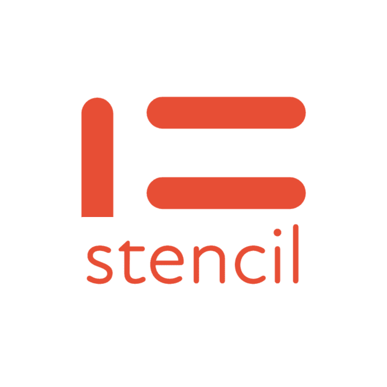

<div align="center">
  <a href="https://stencil.rgst.io">
    
  </a>

  <p><em>A modern living-template engine for evolving repositories.</em></p>

  <a href="https://github.com/rgst-io/stencil/releases">
    
  </a>
  <a href="https://github.com/rgst-io/stencil/blob/main/LICENSE">
    
  </a>
  <a href="https://github.com/rgst-io/stencil/actions/workflows/tests.yaml">
    
  </a>
  <a href="https://app.codecov.io/gh/rgst-io/stencil">
    
  </a>
  <hr />
</div>

Check out our [Documentation](https://stencil.rgst.io/) for more
information!

<!-- mise run update-readme-toc -->
<!-- toc -->

- [Install](#install)
  - [Homebrew](#homebrew)
  - [APT](#apt)
  - [Binary](#binary)
  - [<code>go install</code>](#go-install)
- [Development](#development)
  - [Prerequisites](#prerequisites)
  - [Building](#building)
  - [Testing](#testing)
  - [Releasing](#releasing)
  - [Building docs](#building-docs)
- [License](#license)
<!-- /toc -->

## Install

### Homebrew

```bash
brew install rgst-io/tap/stencil
```

### APT

```bash
sudo apt update -y
sudo apt install -y gpg sudo wget curl
sudo install -dm 755 /etc/apt/keyrings
wget -qO - https://pkg.rgst.io/apt/gpg.key | gpg --dearmor | \
  sudo tee /etc/apt/keyrings/stencil-archive-keyring.gpg 1>/dev/null
echo "deb [signed-by=/etc/apt/keyrings/stencil-archive-keyring.gpg] https://pkg.rgst.io/apt /" | \
  sudo tee /etc/apt/sources.list.d/stencil.list
sudo apt update
sudo apt install stencil
```

### Binary

Download the latest release from the [releases](/releases) page.

### `go install`

```bash
go install github.com/rgst-io/stencil@latest
```

## Development

### Prerequisites

**Note**: If you opt to not use `mise`, please install all dependencies
from `.tool-versions` manually.

- [mise](https://github.com/jdx/mise?tab=readme-ov-file#quickstart) -
  Ensure that you add the appropriate activations to your shell
  rc/profiles (details in the mise README)

Install the dependencies:

```bash
mise install
```

### Building

```bash
mise run build
```

### Testing

```bash
mise run test
```

### Releasing

Trigger a new releases by using the Github CLI, or through the
[Github Actions Workflow UI](https://github.com/rgst-io/stencil/actions/workflows/release.yaml).

```bash
gh workflow run release.yaml
```

Wait for CI to build and publish the release. You can watch the status
by running the following command:

```bash
gh workflow view release.yaml --web
```

### Building docs

If you have `mise` installed, you should have all the tooling you need
for the docs engine. Run `mise run docsdev` from the root stencil
directory to enter the watch-rebuild cycle to test your docs changes.

## License

Apache-2.0
